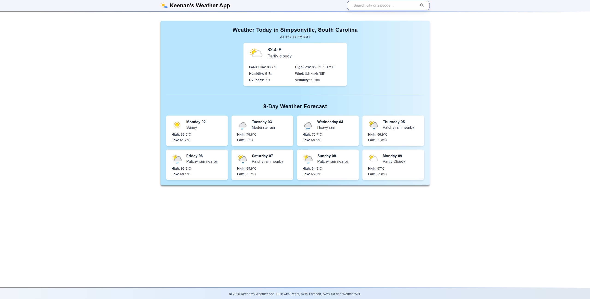

<h1 align="center">🌦️ Keenan's Weather App</h1>

  A weather application built with React, Vite, AWS Lambda, and WeatherAPI.

 

<h2>🌐 Live Link</h2>

  You can try the deployed version of this app here: 
  <a href="http://weatherapp-frontend-keengunt.s3-website.us-east-2.amazonaws.com/" target="_blank">
    http://weatherapp-frontend-keengunt.s3-website.us-east-2.amazonaws.com/
  </a>

<h2>🔧 Tech Stack</h2>

<ul>
  <li><strong>Frontend:</strong> React, Vite, TypeScript, Tailwind CSS, MUI</li>
  <li><strong>Backend:</strong> AWS Lambda (Node.js / TypeScript) via API Gateway</li>
  <li><strong>Weather Data:</strong> <a href="https://www.weatherapi.com/" target="_blank">WeatherAPI</a></li>
  <li><strong>CI/CD:</strong> GitHub Actions (for deploying frontend to S3 and backend to Lambda)</li>
</ul>

<h2>🚀 Setup Instructions</h2>

<ol>
  <li>Clone the repo:</li>

  <pre><code>git clone https://github.com/your-username/your-weather-app.git
cd your-weather-app</code></pre>

  <li>Install and run the frontend:</li>

  <pre><code>cd frontend
npm install
npm run dev</code></pre>

  <li><strong>No <code>.env</code> file is needed for local development.</strong></li>
</ol>

<h2>🖼️ Screenshot</h2>

  

---

  Made by Keenan Gunter

